# IA626_Final_Project_Buckleln

I am a very passionate fantasy fan, and my favourite is fantasy hockey however there is a lack of online tools available to aid people in their quests for a fantsy championship.
For my project I set out to develop an API that can aid fantasy managers in player analysis and give reports on a player of their choosing, spcific to the scoring settings of their league. 
The player analysis would consist of calculting their fantasy point output per game rates from the current year, as well as their average from the past three years, how it changed, and where they are currently playing in their respective lineups.
All of this information can be used to help you judge the effectiveness of a player, determine if they are overperforming, underperfoming or performing as expected.  

This project had 4 major components: 
1. Desing and creation of the SQL database to store the data in
1. Webscraping to get neccesary data for the tool
2. ETL processes in order to prepare and load data into a relational database
3. Building an API that queries the SQL database to get the information about a certain player and then displays the information back.

SQL DATABASE
For this project I designed a rather simple SQL data base in order to store the data that I planned on scraping.
An ERD for this data was produced on ERDplus:
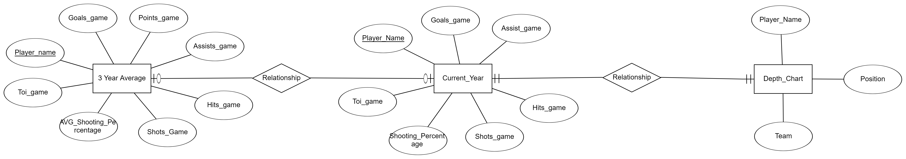

There are 3 tables that were created, one to store the last three year's stats, one for the current year's stats, and one for the current rosters.  

The tables were created in python by establishing a connection to the datbase using pymysql and running the following statements to build the tables:
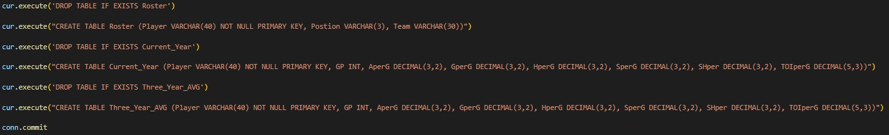

WEBSCRAPING AND LOADING DATA  
For this project there were two main data sources. The first being the webstie https://www.naturalstattrick.com/  
This website has player stats from each year dating back to 2007. Retreiving data from this website was rather easy as all fo the data was stored in an HTML table that was retreived using pandas read_html function.  
Pandas read_html was used on the URL:  
https://www.naturalstattrick.com/playerteams.php?fromseason=20192020&thruseason=20212022&stype=2&sit=all&score=all&stdoi=std&rate=n&team=ALL&pos=S&loc=B&toi=0&gpfilt=none&fd=&td=&tgp=410&lines=single&draftteam=ALL  
in order to load the player statistics into a dataframe.
The dataframe then converted all of the counting stats to per game rates and then stored these new values in a csv file. 
The following code was used to do this:  
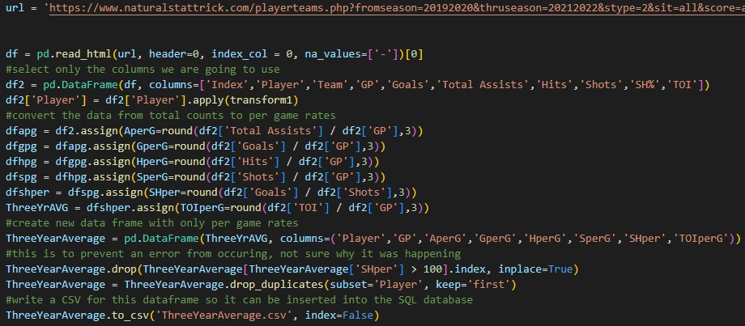  

Once csv file was obtained, the data was then inserted row by row into the SQL database using the following code:  
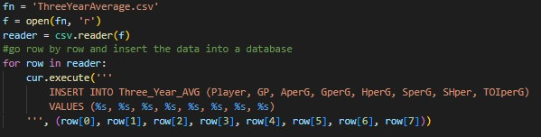  

The same steps were repeated but on the page that has this current year's stats only.  
The url used for this was:  
https://www.naturalstattrick.com/playerteams.php?fromseason=20222023&thruseason=20222023&stype=2&sit=all&score=all&stdoi=std&rate=n&team=ALL&pos=S&loc=B&toi=0&gpfilt=none&fd=&td=&tgp=410&lines=single&draftteam=ALL  
and the code used on this URL was:  
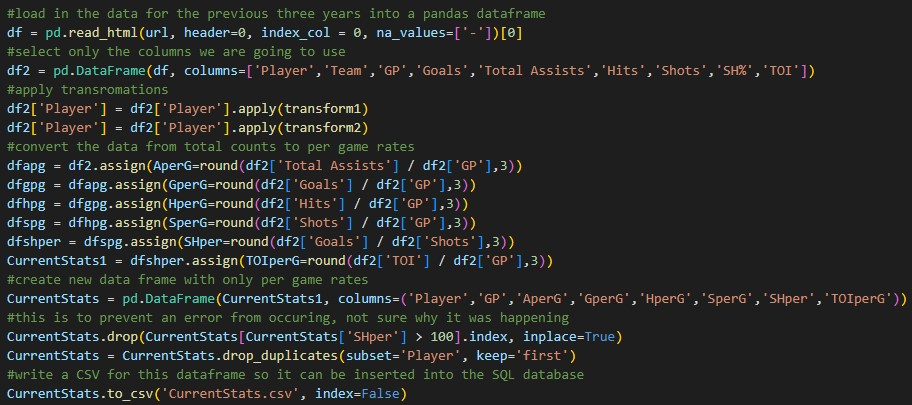  

Once csv file was obtained, the data was then inserted row by row into the SQL database using the following code:  
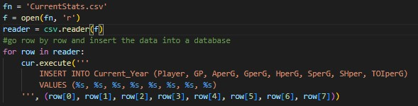  

After this, the final data that was scraped was the current depth charts from the website:  
https://www.dailyfaceoff.com/teams/  

In order to scrape this data, first I located the links for each team from the homepage.  
The links were located in in the href within "a" where the class is "player-name".  
By using this, I was able to iterate through and retreive the html page for each team, get the player name and position for each player on each team, and load it into a csv file.  
The code used was:  
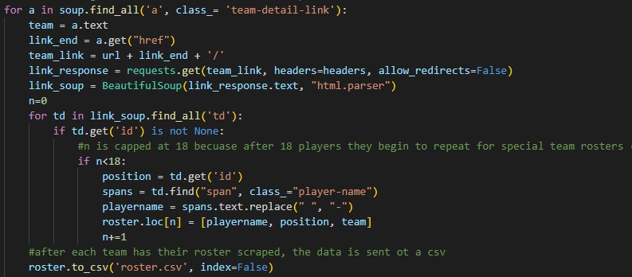  
After each team's data was loaded into the csv file it was then uploaded into the Roster table in the mySQL database using this code:  
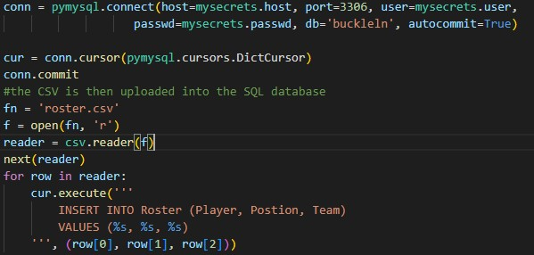  

API

The final step in this project was to build an API using FLASK in order to interact with the database and give outputs based on the scoring values for your specific league.  
First, the three query statements were defined as:  
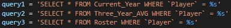  

Next the report route for the API was created:  
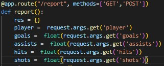  
The arguments this API takes in are:  
Player name as "player="  where the player's first and last name are separated with a '-'
points for a goal in your league as "goals=x" 
points for an assist in your league as "assists=x"  
points for a hit in your league as "hits=x"  
points for a shot in your league as "shots=x"  
After the function takes in each of these values, it then runs the three queries previously defined on the database with the player as the argument.
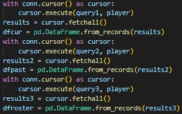  
Once all the data is sotred, the fantasy points per game for the current year, past years, change between the two, the change in shooting percentage form previous years to this year, and the chaneg in time on ice are all calculated and stored into a dictionary.  
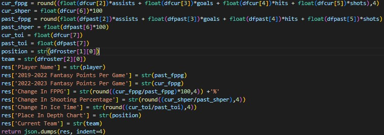  

The dictionary is then returned in a JSON dump and the results can be viewed at the app host:  
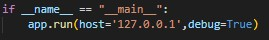

Here is an example of what it would look like if you wanted a report on a player named Anze Kopitar and had the league scoring settings of:  
goals = 3  
assists = 3  
hits = 1  
shots = 1  

URL:  
http://127.0.0.1:5000/report?player=Anze-Kopitar&goals=3&assists=3&shots=1&hits=1  

Output:  
{ "Player Name": "Anze-Kopitar", "2019-2022 Fantasy Points Per Game": "6", "2022-2023 Fantasy Points Per Game":  
 "5.55", "Change In FPPG": "92.5%", "Change In Shooting Percentage": "1.4545", "Change In Ice Time": "0.9533",  
 "Place In Depth Chart": "C1", "Current Team": "Los Angeles Kings" }  
 
 
FILES INCLUDED IN THIS REPOSITORY:  
**** It should be noted that the mysecrets file which was used to access the databse is not included in this repository but it should work if you have your own login information to the mySQL databse.****  

This project was split into three .py files: 

The first is the file Initial_processes.py which only needs to be run a single time. running this file will create all the tables in the SQL database, as well as scrape, process and load the data for the previous years stats since these values wont change (until next year).  

The second file is the file Secondary_Process.py which should be run before you want to use the API. This file will scrape the up to date stats for the current year as well as the up to date rosters for that day, and load them both into their respective tables in the SQL database.  

The third file is the main.py file which is ran in the terminal to bring the API online. Running this file will hos tthe API on your local device and allow you to acces the host URL on your browser to use the URL.

